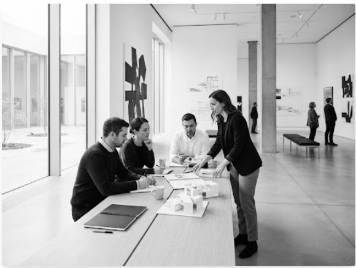

# ONG-GROUP-6-PROJET-1

## Pre-requis:

### Etape 1 : installation de make

```bash
winget install ezwinports.make
```

### Etape 2 : installation de biome

```bash
make install
```

### Etape 3 : Extension VS Code (Recommandé)

Acceptez l'installation de l'extension Biome qui vous sera proposée.

> **Astuce :** Faites `Ctrl + Shift + P` et cherchez : **Biome: Restart LSP Server**.

### Etape 4 : check le formatage

```bash
make check
```

### Etape 5 : formater correctement

```bash
make format
```

## Workflow

### 1. Au début

Récupérer le code propre et formater l'espace de travail

```bash
make sync
```

### 2. Avant de Push (Vérifier)

Valider pour éviter les conflits d'indentation

```bash
make check
make format
```

## Conflicts rencontrés

### Conflicts 1

```html
<!DOCTYPE html>
<html lang="en">

<head>
    <meta charset="UTF-8">
    <meta name="viewport" content="width=device-width, initial-scale=1.0">
    <title>Mayela | Faire vivre l'art</title>

    <link rel="preconnect" href="https://fonts.googleapis.com">
    <link rel="preconnect" href="https://fonts.gstatic.com" crossorigin>
    <link
        href="https://fonts.googleapis.com/css2?family=Inter:ital,opsz,wght@0,14..32,100..900;1,14..32,100..900&family=JetBrains+Mono:ital,wght@0,100..800;1,100..800&display=swap"
        rel="stylesheet">

    <link rel="stylesheet" href="css/index.css">
</head>

<body>


    <nav class="navbar_bloc">
        <div class="base_width">
                <div class="navbar_logo">
                    mayela
                </div>
                <ul class="navebar_links">
                    <li><a href="#missions">mission</a></li>
                    <li><a href="#actions">actions</a></li>
                    <li><a href="#projets">projets</a></li>
                    <li><a href="#evenements">evenements</a></li>
                    <li><a href="#contact">contact</a></li>
                </ul>
                 <button class="navbar_btn_don button__small button-primary">Faire un don</button>
            </div>

    </nav>


    <header class="layout-base">

    </header>

    <main>


        <section class="hero_section" id="missions">
              <div class="principal_container base_width ">
                 <div class="left_box">
                    <div class="small_title">MANIFESTE INSTITUTIONNEL</div>
                    <h1>Faire Vivre l'art , partager <br>les savoirs, connecter les <br> communautés</h1>
                    <p class="description-title"> Notre Mission: Nous dynamisons le territoire à travers des initiatives culturelles accessibles à tous. Notre objectif est de soutenir la création locale et de briser les barrières d'accès à la culture.</p>


                    <div class="btn-group ">
                        <button class="button__icon button-primary">
                            Découvrir notre impact
                            <svg xmlns="http://www.w3.org/2000/svg" width="18" height="18" viewBox="0 0 24 24" fill="none"
                                stroke="currentColor" stroke-width="2" stroke-linecap="round" stroke-linejoin="round"
                                class="lucide lucide-arrow-right-icon lucide-arrow-right">
                                <path d="M5 12h14" />
                                <path d="m12 5 7 7-7 7" />
                            </svg>
                        </button>
                        <button class="button button-secondary btn-outline">Nous rejoindre</button>
                    </div>
                </div>

                <div class="right-box">
                        
                </div>


              </div>
        </section>


<<<<<<< feat/section-nos-projets
        <!-- Commencer sur la version mobile (mobile-first) pour le responsive -->
        <!-- layout-base pour l'espace [padding] par default -->
<section class="layout-base">
    <div class="flex column flex-start">
        <h2>Nos Projets</h2>
        <p class="card-description">Découvrez nos quatre piliers d'intervention directe.</p>
    </div>
        <br />
    <div class="projects-grid">
        <div class="card">
            <div class="card-top">
                <div class="flex column">
                    <svg xmlns="http://www.w3.org/2000/svg" viewBox="0 0 24 24" fill="none"
                    stroke="currentColor" stroke-width="2" stroke-linecap="round" stroke-linejoin="round"
                    class="card-icon">
                    <path d="M16 21v-2a4 4 0 0 0-4-4H6a44 0 0 0-4 4v2"/>
                    <circle cx="9" cy="7" r="4"/>
                    <path d="M22 21v-2a4 4 0 0 0-3-3.87"/>
                    <path d="M16 3.13a4 4 0 01 0 7.75"/>
                    </svg>
                    <h3 class="card-title">Médiation culturelle</h3>
                    <p class="card-description">Des ateliers artistiques hebdomadaires au cœur
                    desquartiers pour favoriser l'expression citoyenne.</p>
                </div>
            </div>
            <div class="card-bottom">
                <span class="card-label">Actions de proximité</span>
            </div>
        </div>
        <div class="card">
            <div class="card-top">
                <div class="flex column">
                    <svg xmlns="http://www.w3.org/2000/svg" viewBox="0 0 24 24" fill="none"
                    stroke="currentColor" stroke-width="2" stroke-linecap="round" stroke-linejoin="round"
                    class="card-icon">
                    <path d="M12 22a1 1 0 0 1 0-20 10 9 0 0 1 10 9 5 5 0 0 1-5 5h-2.25a1.75
                    1.75 0 00-1.4 2.8l.3.4a1.75 1.75 0 0 1-1.4 2.8z"/>
                    <circle cx="13.5" cy="6.5" r=".5" fill="currentColor"/>
                    <circle cx="17.5" cy="10.5" r=".5" fill="currentColor"/>
                    <circle cx="6.5" cy="12.5" r=".5" fill="currentColor"/>
                    <circle cx="8.5" cy="7.5" r=".5" fill="currentColor"/>
                    </svg>
                    <h3 class="card-title">Soutien à la création</h3>
                    <p class="card-description">Bourses de recherche et mise à disposition
                    d'ateliers pour les artistes émergents et confirmés.</p>
                </div>
            </div>
            <div class="card-bottom">
              <spanclass="card-label">Résidences d'artistes</span>
            </div>
        </div>
        <div class="card">
            <div class="card-top">
                <div class="flex column">
                    <svg xmlns="http://www.w3.org/2000/svg" viewBox="0 0 24 24" fill="none"
                    stroke="currentColor" stroke-width="2" stroke-linecap="round" stroke-linejoin="round"
                    class="card-icon">
                    <circle cx="18" cy="5" r="3"/>
                    <circle cx="6" cy="12" r="3"/>
                    <circle cx="18" cy="19" r="3"/>
                    <line x1="8.59" x2="15.42" y1="13.51" y2="17.49"/>
                    <line x1="15.41" x2="8.59" y1="6.51" y2="10.49"/>
                    </svg>
                    <h3 class="card-title">Diffusion grand public</h3>
                    <pclass="card-description">Organisation de festivals, projections en plein air et
                    concerts gratuits pour animer l'espace public.</p>
                </div>
            </div>
            <div class="card-bottom">
                <spanclass="card-label">Événementiel</span>
            </div>
        </div>
        <div class="card">
            <div class="card-top">
                <div class="flex column">
                    <svg xmlns="http://www.w3.org/2000/svg" viewBox="0 0 24 24" fill="none" stroke="currentColor" stroke-width="2" stroke-linecap="round" stroke-linejoin="round" class="card-icon">
                    <line x1="3" x2="21" y1="22" y2="22"/>
                    <line x1="6" x2="6" y1="18" y2="11"/>
                    <line x1="10" x2="10" y1="18" y2="11"/>
                    <line x1="14" x2="14" y1="18" y2="11"/>
                    <line x1="18" x2="18" y1="18" y2="11"/>
                    <polygon points="12 2 20 7 4 7"/>
                    </svg>
                    <h3 class="card-title">Valorisation du patrimoine</h3>
                    <p class="card-description">Visites guidées thématiques et numérisation des
                    archives locales pour préservernotre mémoire collective.</p>
                </div>
            </div>
            <div class="card-bottom">
             <spanclass="card-label">Conservation</span>
            </div>
        </div>
    </div>
</section>
<!-- Agenda -->
=======


        <section class="chiffre_section" id="actions">
              <h2>NOS ACTIONS </h2>
            <div class="base_width_small chiffre_content">
                <article>
                    <p class="small_title"> longévité</p>
                    <p class="big_title_chiffre">10 ans d'impact culturel. </p>
                </article>

                <article>
                    <p class="small_title"> Activité</p>
                    <p class="big_title_chiffre">150+ projets réalisés. </p>
                </article>

                <article>
                    <p class="small_title"> communauté</p>
                    <p class="big_title_chiffre">5 000+ bénéficiaires par ans. </p>
                </article>
            </div>

        </section>


        <!-- section des chiffres  -->


>>>>>>> main
    </main>
    <!-- le pied de page -->
    <footer class="site-footer">
  <div class="footer-inner layout-narrow">

    <div class="flex column">
      <span class="footer-brand-name">Akieni Academy</span>
      <span class="footer-brand-tagline">© 2026. Tous droits réservés.</span>
    </div>

    <nav class="footer-links">
      <a href="#">Mentions légales</a>
      <a href="#">Politique de confidentialité</a>
      <a href="#">Contact</a>
    </nav>

    <div class="footer-socials">
      <a href="#" aria-label="LinkedIn">
        <svg xmlns="http://www.w3.org/2000/svg" viewBox="0 0 24 24" fill="none" stroke="currentColor" stroke-width="2" stroke-linecap="round" stroke-linejoin="round">
          <path d="M16 8a6 6 0 0 1 6 6v7h-4v-7a2 2 0 0 0-2-2 2 2 0 0 0-2 2v7h-4v-7a6 6 0 0 1 6-6z"/>
          <rect width="4" height="12" x="2" y="9"/>
          <circle cx="4" cy="4" r="2"/>
        </svg>
      </a>
      <a href="#" aria-label="Twitter">
        <svg xmlns="http://www.w3.org/2000/svg" viewBox="0 0 24 24" fill="none" stroke="currentColor" stroke-width="2" stroke-linecap="round" stroke-linejoin="round">
          <path d="M22 4s-.7 2.1-2 3.4c1.6 10-9.4 17.3-18 11.6 2.2.1 4.4-.6 6-2C3 15.5 1.5 9.9 2 6c2.2 2.6 5.6 4.1 9 4-.9-4.2 4-6.6 7-3.8 1.1 0 3-1.2 3-1.2z"/>
        </svg>
      </a>
    </div>

  </div>
</footer>
</body>
</html>
```

### Conflits 2

```html
<<<<<<< feat/newletter
        </div>
    </div>
</section>

<!-- Agenda -->


<!-- Section newsletter -->
 <section class="layout-base newsletter-section" id="newsletter">
    <div class="base_width newsletter-content">
        

        <h2>Rejoignez le mouvement</h2>
        <p class="card-description">
            Abonnez-vous pour recevoir les invitations à nos prochains
            vernissages et événements exclusifs.
        </p>

        <form class="form__newsletter">
            <fieldset>
                <legend>Newsletter</legend>
                <div class="input-group__newsletter">
                    <input
                        class="input__newsletter"
                        id="newsletter-email"
                        name="email"
                        type="email"
                        placeholder="votre@email.com"
                        autocomplete="email"
                        required
                    >
                </div>
            </fieldset>
            <button class="button button-primary" type="submit">
                S'inscrire
            </button>
        </form>
    </div>
</section>
=======
        </section>
>>>>>>> main
    </main>
```

### Conflict 3

```html
<<<<<<< feat/form
    <link rel="stylesheet" href="css/tools/layout.css">
    <link rel="stylesheet" href="css/sections/form.css">
=======
    <link rel="stylesheet" href="css/sections/newsletter.css">
>>>>>>> main
</head>

<<<<<<< feat/form
        </div>
    </div>
</section>
<!-- Agenda -->
 <!-- Début section NOUS CONTACTER : Grâsty Ghyvet SAMBA DINAULT -->
  <section class="layout-base section form-section">
    <div class="form-grid">
    <div class="flex column">
        <form method="post" class="form">
            <h2 class="sustain-title">NOUS CONTACTER</h2>
            <div class="input-group">
                <label for="fullname" class="input-label">NOM COMPLET</label>
                <input class="input" type="text" name="fullname" id="fullname" placeholder="Votre nom ici" required minlength="2">
            </div>
            <div class="input-group">
                <label for="professional-mail" class="input-label" >E-MAIL PROFESSIONNEL</label>
                <input class="input" type="email" name="professional-mail" id="professional-mail" placeholder="contact@domaine.com" required>
            </div>
            <div class="input-group">
                <label for="message" class="input-label">MESSAGE</label>
                <textarea class="textarea" name="message" id="message" required minlength="5" placeholder="Comment pouvons-nous collaborer ?"></textarea>
            </div>
            <div>
                <button class="button button-primary">ENVOYER LA DEMANDE</button>
            </div>
        </form>
    </div>
    <div class="flex column sustain">
        <div class="flex sustain-item">
            <h2 class="sustain-title">Soutenir Akieni Academy</h2>
            <p>Votre soutien finance nos ateliers gratuits et permet l'accès à la culture pour les publics les plus fragiles.</p>
        </div>
        <div class="flex sustain-group-btn">
            <button class="button button-secondary">15€</button>
            <button class="button button-secondary">30€</button>
            <button class="button button-secondary">Montant libre</button>
        </div>
        <div class="flex">
            <button class="button button-secondary sustain-submit-btn">SOUTENIR LE PROJET</button>
        </div>
        <div class="sustain-badge">
            <span></span>
            <p>Paiement 100% sécurisé</p>
        </div>
    </div>
    </div>
  </section>
 <!-- Fin Section NOUS CONTACTER -->
=======
        </section>

>>>>>>> main
```

```

```
